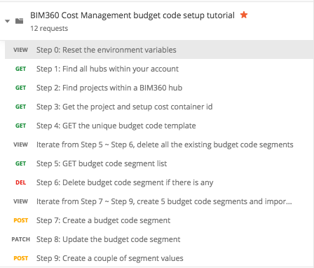

# BIM360 Cost Budget Code Template Setup Tutorial

This folder contains a Postman Collection to show the process of budget code template setup. It will fistly delete any budget segments if existing, then create 5 new budget segments and import budget segment values accordingly.

## Demonstration
TBD

## Preparation before you begin:
- [Create Forge App, get access to a BIM 360 Account](https://forge.autodesk.com/en/docs/bim360/v1/tutorials/getting-started/get-access-to-account/)
- [Create BIM360 project, activate Cost Management module](https://help.autodesk.com/view/BIM360D/ENU/?guid=BIM360D_Cost_Management_getting_started_with_cost_management_html);

## Instructions to run the Postman tutorial are as below:

**Please watch the [Video](https://youtu.be/tbd) for the detail workflow, or follow the steps:**

### Setup Postman environment and Authorization:
- Import Postman collection, and setup the following environment vialables:
    - in Step 0, Pre-request Script: 
        - Forge Client Key, please change to your Forge Client Id and Secret.
        - Change the project name to the correct one.
        - Base domain, should be https://developer.api.autodesk.com/ by default.
        - Initialize segment_index to 1 by default.

- Please add the Authorization for the collection, click **Edit Collection**, go to **Authorization** tab, make sure to use **OAuth 2.0** to get a 3 legged token, use it in the **Request Headers**.

    - Callback URL: https://www.getpostman.com/oauth2/callback
    - Auth URL: https://developer.api.autodesk.com/authentication/v1/authorize 
    - Access Token URL: https://developer.api.autodesk.com/authentication/v1/gettoken

### Tutorials of BIM360 Cost Budget Code Template Setup workflow
- Step 0: Reset the following environment variables:
    - Forge Client Key, please change to your Forge Client Id and Secret.
    - Project name, please change to the correct project name which you want to work with.
    - Base domain, should be https://developer.api.autodesk.com/ by default.
    - Segment index, will be used to create multiple budget segments, should be 1 by default.
- Step 1: List all the Hubs, and save **hub_id** for the 1st BIM360 Hub, also save **account_id** (Data Management API)
- Step 2: List all the projects in the BIM360 Hub, then get and save **project_id** for the specified **project_name**.
- Step 3: Get the information of the specified BIM360 project, and save **cost_container_id** for the Cost Container(Data Management API).
- Step 4: GET the unique budget code template, should be always only one budget code template in the list by default.

So far, you get the budget code template, let's remove all the existing budget segments if any, iterate step 5 ~ step 6 to remove all the existing budget segments.
- Step 5: GET budget code segment list and keep the 1st budget segment id as segment_id.
Step 6: Delete the budget code segment by segment_id.

Until now, the budget code template is clean, we can iterate the step 7 ~ step 9 to add a couple of budget segments and import segment values.
- Step 7: Create a new budget code segment under the template.
- Step 8: Update the current budget code segment.
- Step 9: Import a couple of segment values

That's it, you should have successfully created a 5 budget segments and importing a couple of segment values. You can really import budgets|contracts|change orders, please refer [BIM360 Cost Management Tutorial](../CostTutorial) for the next step.

## License
This sample is licensed under the terms of the [MIT License](http://opensource.org/licenses/MIT). Please see the [LICENSE](LICENSE) file for full details.

## Written by
Zhong Wu [@johnonsoftware](https://twitter.com/johnonsoftware), [Forge Partner Development](http://forge.autodesk.com)
